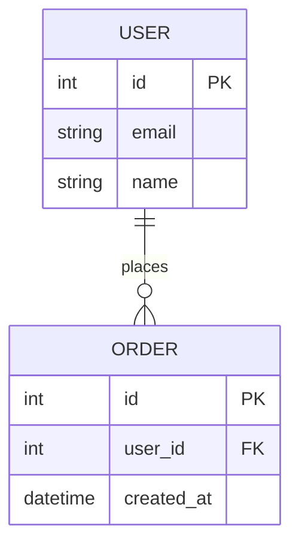
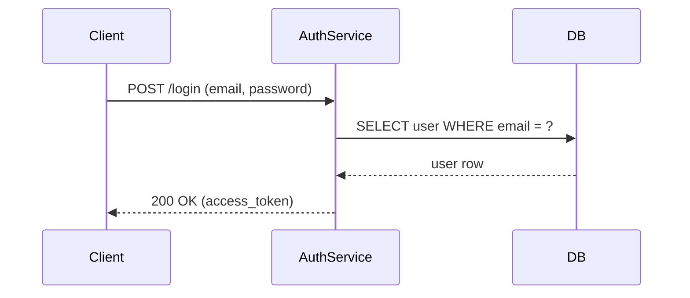
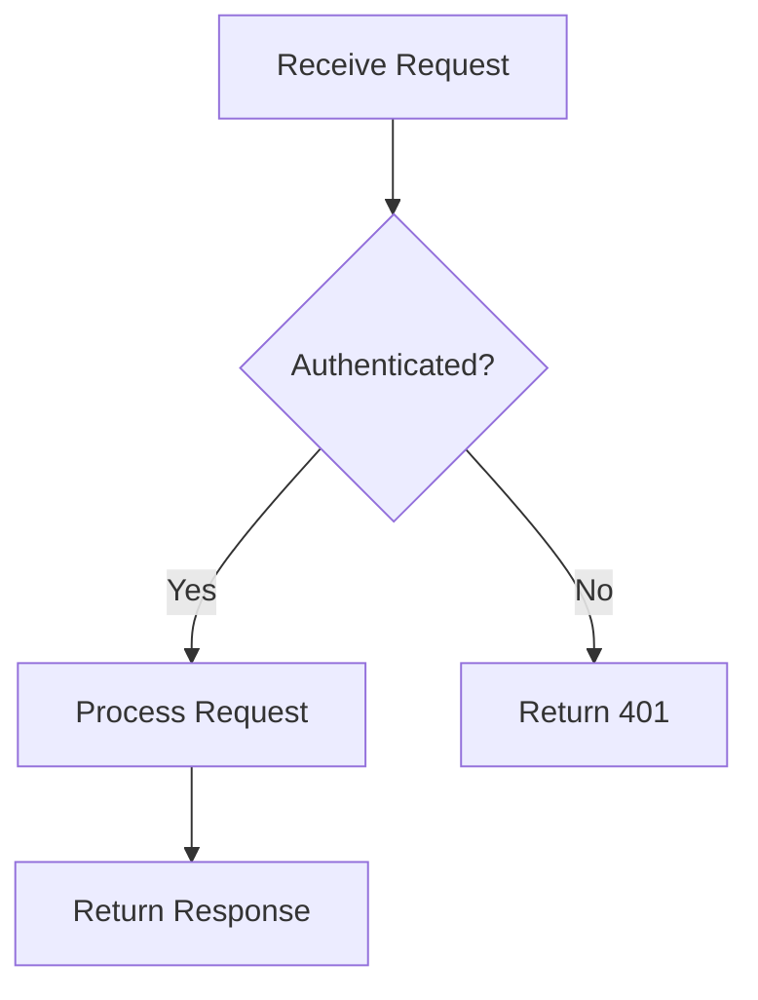
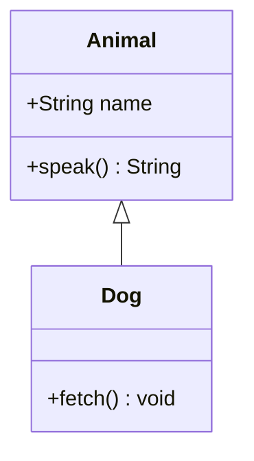

# mermaid skill

A skill for agents that generates [Mermaid](https://mermaid.js.org/) diagrams from source files, schemas, or plain-text descriptions — choosing the right diagram type automatically or using the one you specify.

## Usage

```
/mermaid                           # auto-detect diagram type from current context
/mermaid <description or file>     # target a specific area or describe what to diagram
/mermaid --type=<type>             # force a specific diagram type
/mermaid --output=<file>           # save diagram to a file (asks before writing)
/mermaid --type=<type> --output=<file> <target>  # combine all options
```

The assistant analyzes your source files or description, selects the best diagram type, generates valid Mermaid syntax, optionally validates it with the Mermaid CLI, shows a preview, and waits for your confirmation before writing any file.

## Output Format

Diagrams are rendered inline as a fenced `mermaid` code block. When `--output` is specified the same block is saved to the target file.

**ER diagram** — from a SQL schema or ORM models



**Sequence diagram** — from API route files or a description



**Flowchart** — from a process description or branching logic



**Class diagram** — from class definitions or type hierarchies



## Diagram Types Reference

| Type | Keyword | Best for |
|------|---------|----------|
| Flowchart | `flowchart` | process logic, decision trees, control flow |
| Sequence | `sequence` | request/response flows, component interactions, API calls |
| ER diagram | `er` | database schemas, data models, entity relationships |
| Class diagram | `class` | object hierarchies, interfaces, type relationships |
| State diagram | `state` | lifecycle states, FSMs, workflow states |
| Gantt | `gantt` | project timelines, task schedules |
| Pie chart | `pie` | proportional breakdowns, distribution summaries |
| Mindmap | `mindmap` | concept hierarchies, feature trees |

## Installation

<details>
<summary>Claude Code</summary>

Claude Code supports custom slash commands defined as markdown files under `.claude/commands/`. Dropping `SKILL.md` there registers a `/mermaid` command in any Claude Code session inside that project.

```bash
mkdir -p .claude/commands
cp SKILL.md .claude/commands/mermaid.md
```

For a global install (available in every project):

```bash
mkdir -p ~/.claude/commands
cp SKILL.md ~/.claude/commands/mermaid.md
```

**invoke:** type `/mermaid` in Claude Code (CLI, VS Code extension, or web).

</details>

<details>
<summary>OpenAI Codex</summary>

Codex reads `AGENTS.md` at the project root as a persistent instruction file. Reference `SKILL.md` from there so Codex follows the diagram conventions whenever you ask it to generate a diagram.

```bash
cp SKILL.md SKILL.md   # keep the skill file in your repo root
```

Then add to `AGENTS.md`:

```markdown
## diagram conventions
when generating mermaid diagrams, follow the rules defined in SKILL.md exactly.
```

For a global install, append the skill to your user-level instructions:

```bash
cat SKILL.md >> ~/.codex/instructions.md
```

**invoke:** `codex "generate a mermaid diagram for the user auth flow"` or ask inside a session: `diagram the database schema`.

</details>

<details>
<summary>GitHub Copilot</summary>

Copilot Chat picks up repository-level custom instructions from `.github/copilot-instructions.md`. Paste the skill content there so Copilot follows the same conventions.

```bash
mkdir -p .github
cat SKILL.md >> .github/copilot-instructions.md
```

**invoke:** open Copilot Chat and say `generate a mermaid diagram for this module` or `diagram the database schema`.

</details>

## Contributing

Open an issue or pull request. Keep commits atomic and follow the commit conventions.

## License

MIT
