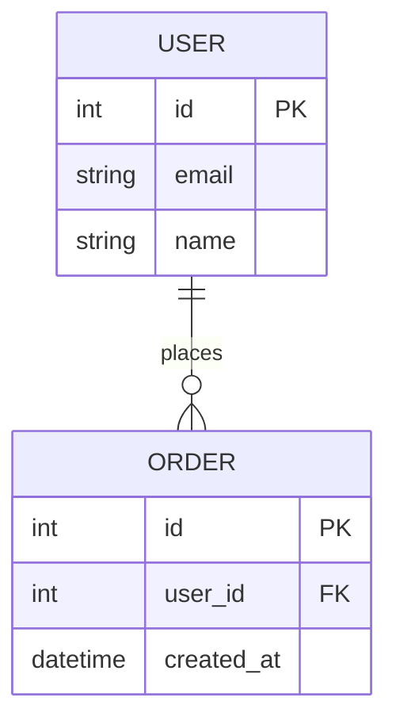

# mermaid skill

A Claude Code skill that analyzes source files, schemas, code, or a plain-text description and produces a Mermaid diagram — choosing the right diagram type automatically or using the one you specify.

## features

- auto-detects the best diagram type from context: SQL files → ER, request flows → sequence, class hierarchies → class, logic/process → flowchart
- accepts a target: a file, directory, glob, or free-text description
- supports forced type with `--type=<type>` when you know what you want
- writes to a file with `--output=<path>`, or prints to the terminal if omitted
- validates syntax with the mermaid CLI before saving when `npx` is available
- always shows a preview and waits for confirmation before writing any file

## usage

```
/mermaid                           # auto-detect diagram type from current context
/mermaid <description or file>     # target a specific area or describe what to diagram
/mermaid --type=<type>             # force a specific diagram type
/mermaid --output=<file>           # save diagram to a file (asks before writing)
/mermaid --type=<type> --output=<file> <target>  # combine all options
```

**examples**

```
/mermaid                           # infer from open files or recent context
/mermaid src/models/               # ER or class diagram from model files
/mermaid schema.sql                # ER diagram from SQL schema
/mermaid "user authentication flow"  # sequence diagram from a description
/mermaid --type=flowchart src/checkout.py  # force flowchart for a specific file
/mermaid --output=docs/arch.md     # save to file after confirmation
```

## diagram types

| Type | Keyword | Best for |
|------|---------|----------|
| Flowchart | `flowchart` | process logic, decision trees, control flow |
| Sequence | `sequence` | request/response flows, component interactions, API calls |
| ER diagram | `er` | database schemas, data models, entity relationships |
| Class diagram | `class` | object hierarchies, interfaces, type relationships |
| State diagram | `state` | lifecycle states, FSMs, workflow states |
| Gantt | `gantt` | project timelines, task schedules |
| Pie chart | `pie` | proportional breakdowns, distribution summaries |
| Mindmap | `mindmap` | concept hierarchies, feature trees |

## auto-detection rules

When no `--type` flag is given, choose the diagram type by examining:

1. **File extension and content signals**
   - `.sql`, `schema.*`, migration files, ORM model files → `er`
   - files with class definitions, interfaces, type hierarchies → `class`
   - files describing request handling, middleware chains, service calls → `sequence`
   - files with conditional branching, pipelines, process logic → `flowchart`
2. **Description keywords** (when a free-text description is provided)
   - "flow", "process", "steps", "pipeline", "decision" → `flowchart`
   - "request", "response", "calls", "sends", "receives", "interactions" → `sequence`
   - "schema", "table", "entity", "model", "database", "relation" → `er`
   - "class", "interface", "inherit", "extend", "implement" → `class`
3. **Project context** (when invoked with no arguments)
   - look at the current directory: SQL/migration files present → `er`; heavily object-oriented source → `class`; API route files or controller files → `sequence`
   - default to `flowchart` when signals are ambiguous

## output format

Diagrams are always shown in a fenced markdown code block:

````markdown

````

If `--output` is specified, the content saved to file is the fenced `mermaid` block. Plain `.mmd` output (no surrounding markdown) is used when the target file extension is `.mmd`.

## workflow

1. **parse arguments**: extract `--type`, `--output`, and the remaining target (file, directory glob, or description string); if target is a path, verify it exists
2. **gather context**:
   - if a file or directory was given: read the relevant source files (SQL schemas, model definitions, class files, route files); focus on structure, not implementation detail
   - if a description was given: use it as the primary specification
   - if no arguments: scan the current working directory for the strongest structural signals (schemas, models, routes, main entry point)
3. **determine diagram type**:
   - if `--type` was given, use it directly; validate that the value is one of the recognized keywords in the reference table above; if not, show the table and ask the user to pick
   - otherwise, apply the auto-detection rules in order; if signals conflict or are absent, default to `flowchart` and note the fallback to the user
4. **extract entities and relationships** from the gathered context:
   - for `er`: tables/models → entities, foreign keys and associations → relationships with cardinality
   - for `class`: classes/interfaces/types → nodes, inheritance/composition/implementation → edges
   - for `sequence`: actors/services/components → participants, calls/events/responses → messages with labels
   - for `flowchart`: steps/conditions/branches → nodes, execution order and decision outcomes → edges
   - for other types: extract the relevant structural elements following the same principle
5. **draft the diagram**: write valid Mermaid syntax; apply best practices from the section below; for `flowchart` use `flowchart TD` (top-down) unless the layout is clearly left-to-right; keep the diagram focused — omit low-signal implementation details
6. **validate syntax** (when `npx` is available):
   - write the diagram to a temporary file
   - run: `npx -p @mermaid-js/mermaid-cli mmdc -i <temp>.md -o /tmp/mermaid-test-out.md`
   - if validation fails, read the error, fix the syntax, and re-validate; surface the error to the user if it cannot be resolved automatically
   - if `npx` is unavailable, skip validation and note this to the user
7. **show preview**: display the complete diagram in a fenced `mermaid` code block; state the detected or forced diagram type, the source analyzed, and whether validation passed
8. **ask for confirmation**: prompt — "save to `<output path>`?" — only when `--output` was given; if no output path was given, the diagram is already visible and no file action is needed
9. **on approval**: write the diagram to the specified output path; do not run any git commands unless the user explicitly asks
10. **on edit request**: ask what to change, apply edits, re-validate if possible, show the revised diagram, and return to step 8

## best practices

- **keep diagrams focused** — one diagram per concern; a 30-node diagram is usually too large; consider splitting
- **consistent naming** — use the same identifier style throughout a diagram (camelCase or snake_case, not mixed)
- **group with subgraphs** — in flowcharts, use `subgraph` to cluster related steps
- **label relationships** — always add a label to edges in ER diagrams (`USER ||--o{ ORDER : places`); add message labels in sequence diagrams
- **cardinality in ER** — always include cardinality markers (`||`, `o{`, `|{`, etc.) on ER relationships
- **top-down default** — prefer `flowchart TD` over `LR` unless the diagram is clearly a left-to-right pipeline
- **no implementation noise** — omit private helpers, internal variables, and low-level implementation details; diagram structure and behavior, not mechanics
- **valid identifiers** — avoid spaces in node IDs; use quotes for display labels that contain spaces: `A["User Service"]`
- **never auto-commit** — writing the diagram file is the final step; do not stage or commit unless the user asks
